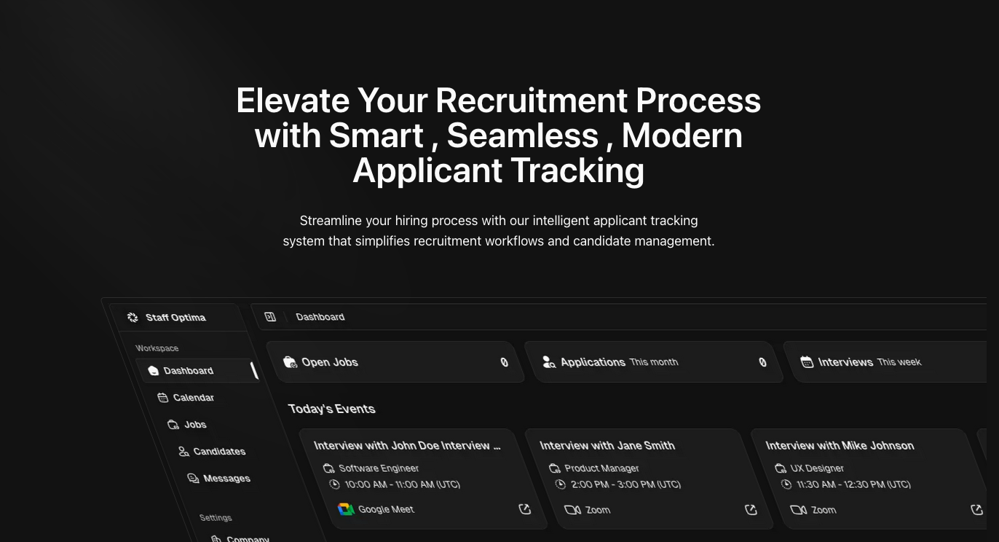

<p align="center">
	<h1 align="center"><b>Staff Optima</b></h1>
<p align="center">
    An open-source modern Applicant Tracking System (ATS)
    <br />
    <br />
    <a href="https://staffoptima.co"><strong>Website</strong></a> · 
    <a href="https://github.com/AshrafElshaer/staff-optima/issues"><strong>Issues</strong></a> · 
    <a href="#features"><strong>Features</strong></a> ·
    <a href="#tech-stack"><strong>Tech Stack</strong></a> ·
    <a href="#prerequisites"><strong>Prerequisites</strong></a> ·
    <a href="#getting-started"><strong>Getting Started</strong></a> ·
    <a href="#license"><strong>License</strong></a>
  </p>
</p>

## Introduction

Staff Optima is a modern, open-source Applicant Tracking System (ATS) designed to streamline your hiring process. Built with cutting-edge technologies, it helps organizations manage their recruitment workflow efficiently - from job posting and candidate screening to interview scheduling and offer management. Our platform emphasizes user experience, scalability, and integration capabilities while maintaining the flexibility and transparency that comes with open-source software.


## Features


- **Job Posting**: Create and manage job listings with ease with integrated apps like LinkedIn, X, and more.
- **Candidate Management**: Track applications, resumes, and interview notes in one place.
- **Interview Scheduling**: Schedule interviews with ease and send automated reminders.
- **Reporting and Analytics**: Get insights into your hiring process with built-in reports and analytics.
- **Integration**: Integrate with your existing tools and workflows.
- **Customizable Workflow**: Tailor the process * stages to your needs.
- **Automated Communication**: Send automated emails to candidates at each stage of the hiring process.


## Tech Stack

[Next.js](https://nextjs.org/) - Framework<br>
[Turborepo](https://turbo.build) - Build system<br>
[Biome](https://biomejs.dev) - Linter, formatter<br>
[TailwindCSS](https://tailwindcss.com/) - Styling<br>
[Shadcn](https://ui.shadcn.com/) - UI components<br>
[TypeScript](https://www.typescriptlang.org/) - Type safety<br>
[Supabase](https://supabase.com/) - Authentication, database, storage<br>
[Upstash](https://upstash.com/) - Cache and rate limiting<br>
[React Email](https://react.email/) - Email templates<br>
[Resend](https://resend.com/) - Email delivery<br>
[Sentry](https://sentry.io/) - Error handling/monitoring<br>
[Dub](https://dub.sh/) - Sharable links<br>
[Trigger.dev](https://trigger.dev/) - Background jobs<br>
[OpenPanel](https://openpanel.dev/) - Analytics<br>
[Polar](https://polar.sh) - Billing (coming soon)<br>
[react-safe-action](https://next-safe-action.dev) - Validated Server Actions<br>
[nuqs](https://nuqs.47ng.com/) - Type-safe search params state manager<br>
[next-themes](https://next-themes-example.vercel.app/) - Theme manager<br>

## Directory Structure

```
.
├── apps                         # App workspace
│    ├── dashboard               # Dashboard - your product
│    ├── web                     # Marketing site
│    ├── jobs                    # Organization jobs & Profile
├── packages                     # Shared packages between apps
│    ├── analytics               # OpenPanel analytics
│    ├── email                   # React email library
│    ├── editors                 # React Tiptap editors
│    ├── trigger.dev             # Trigger.dev background jobs
│    ├── kv                      # Upstash rate-limited key-value storage
│    ├── locations               # Locations & Timezones
│    ├── logger                  # Logger library
│    ├── supabase                # Supabase - Migrations, Queries, Mutations, Edge Functions & zod schemas
│    └── ui                      # Shared UI components (Shadcn)
├── tooling                      # are the shared configuration that are used by the apps and packages
│    └── typescript              # Shared TypeScript configuration
├── .cursorrules                 # Cursor rules specific to this project
├── biome.json                   # Biome configuration
├── turbo.json                   # Turbo configuration
├── LICENSE
└── README.md
```

## Prerequisites

Bun<br>
Docker<br>
Upstash<br>
Dub<br>
Trigger.dev<br>
Resend<br>
Supabase<br>
Sentry<br>
OpenPanel<br>

## Getting Started

Clone this repo locally with the following command:

```bash
git clone https://github.com/AshrafElshaer/staff-Optima.git
```

1. Install dependencies using bun:

```sh
bun i
```

2. Copy `.env.example` to `.env` and update the variables for each app and package.

```sh
cp apps/dashboard/.env.example apps/dashboard/.env
cp apps/jobs/.env.example apps/jobs/.env
cp apps/web/.env.example apps/web/.env
cp packages/trigger.dev/.env.example packages/trigger.dev/.env
```

3. Setup the Database

```sh
cd packages/supabase
bunx supabase login # login to supabase
bunx supabase link # link the database to the project
bun  run db:push # Push the database schema and migrations to Supabase
bun  run deploy:functions # deploy the edge functions ( requiers to have docker running before deploying )

```

4. Setup the Trigger.dev jobs
[Visit trigger.dev docs](https://trigger.dev/docs/trigger-config) to configure the trigger.dev project.
[Visit trigger.dev docs for supabase edge functions](https://trigger.dev/docs/guides/frameworks/supabase-edge-functions-basic) to set up the supabase edge functions secret key.

```sh
cd packages/jobs
bunx trigger.dev@latest deploy --env-file .env # deploy the trigger.dev jobs
```

5. Start the development server from either bun or turbo:

```ts
bun dev              // starts everything in development mode (web, dashboard, jobs-web, jobs)
bun dev:web          // starts the web app in development mode
bun dev:dashboard    // starts the dashboard in development mode
bun dev:jobs         // starts the jobs-web in development mode
bun dev:trigger.dev  // starts the trigger.dev jobs in development mode

```

### Hosting

- Supabase (database, storage, realtime, auth)
- Vercel (Website, edge-config, and metrics)
- Upstash (redis)


## Repo Activity


## License

This project is licensed under the **[AGPL-3.0](https://opensource.org/licenses/AGPL-3.0)** for non-commercial use. 

### Commercial Use

For commercial use or deployments requiring a setup fee, please contact us
for a commercial license at [engineer@staffoptima.co](mailto:engineer@staffoptima.co).

By using this software, you agree to the terms of the license.